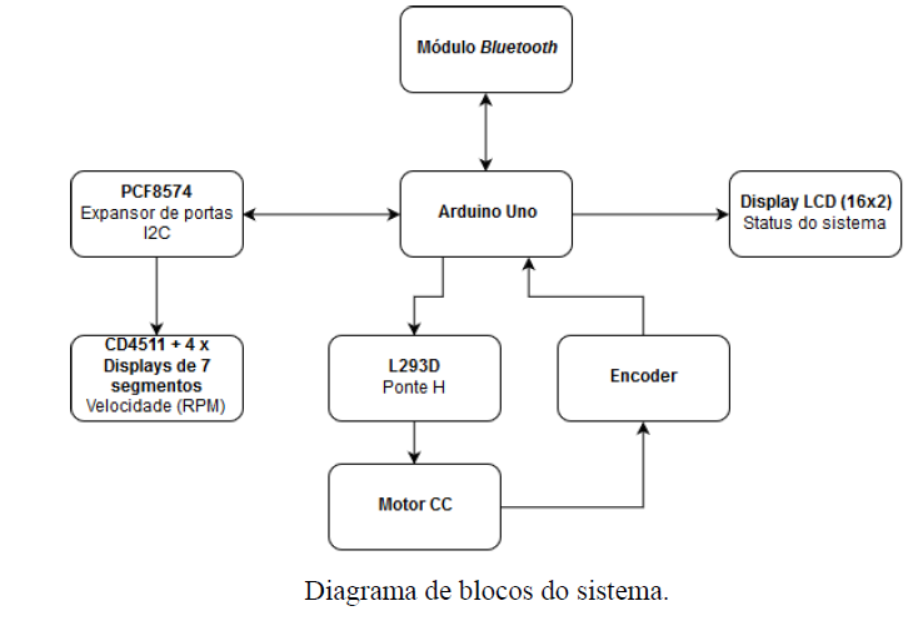

# EA076 - projeto 2

## INTRODUÇÃO

- sistema de acionamento e controle de um ventilador de teto por meio de um aplicativo celular com interface bluetooth,
  contando ainda com displays para indicar o status atual do sistema e a velocidade de rotação do ventilador

## OBJETIVOS

1. acionar um motor CC usando técnica PWM e uma ponte H;
2.  projetar e construir um codificador óptico e usá-lo para estimar a velocidade de um motor;
3.  implementar protocolos de comunicação no nível de aplicação usando parsing;
4. acionar dispositivos através de uma interface I2C;
5. usar um módulo bluetooth para transmissão de comandos para o sistema via celular;

## ESPECIFICAÇÕES DO SISTEMA

O protótipo irá controlar a velocidade e o sentido de rotação de um pequeno motor CC de 5V, simulando um ventilador de teto. O acionamento do motor será realizado através de uma ponte H, utilizando o CI L293D que, além de servir de amplificador, permitirá o controle do sentido de rotação do motor. A velocidade será ajustada por meio de um sinal modulado em largura de pulso (PWM).

Um display LCD 16x2 (16 caracteres por linha, 2 linhas) deve apresentar continuamente o modo atual do ventilador, isto é, um estado entre “VENTILADOR”, “EXAUSTOR” OU “PARADO”, bem como o valor percentual da velocidade máxima (0 a 100%).

A velocidade de rotação do ventilador deve ser estimada através de um codificador ótico acoplado ao motor. Para construir esse codificador, pode ser usado um interruptor ótico PHCT203 (ou equivalente) posicionado de maneira que a hélice do ventilador obstrua o feixe de luz IR (infravermelho) do interruptor ao passar por ele. A cada obstrução do feixe, um pulso é gerado pelo interruptor. A velocidade de rotação do ventilador pode ser estimada através da contagem do número de pulsos gerados durante certo intervalo de tempo.

A estimativa da velocidade atual do motor em RPM deve ser exibida continuamente em um conjunto de 4 displays de 7 segmentos. Como não há portas suficientes para acionar todos os displays simultaneamente, utilizaremos a estratégia de multiplexação no tempo combinada com o decodificador CD4511. Além disso, utilizaremos o CI PCF8574 para conectar os displays usando a interface I2C do microcontrolador. Desse modo, serão necessários apenas dois pinos do microcontrolador para acionar os 4 displays.

O usuário irá controlar remotamente o sistema através de um celular. A comunicação entre o sistema e o celular se dará através de um protocolo serial sem fio via Bluetooth. Para isso, será usado um módulo Bluetooth HC-06 conectado à porta serial da placa de desenvolvimento Arduino UNO. Usaremos no celular um aplicativo simples de terminal serial via Bluetooth, como o Serial Bluetooth Terminal do Android, por exemplo, com os comandos definidos de acordo com a Tabela 1 (o caractere “*” indica o fim do comando). A Tabela 2 mostra as mensagens de erro que devem ser implementadas no sistema e enviadas ao celular (em caso de erro, o estado do ventilador não se altera).

| Função | Comando | Resposta (serial) |
| ------ | ------- | ----------------- |
| Ajuste de velocidade (%) | VEL xxx* (xxx entre 000 e 100) | OK VEL xxx% |
| Função ventoçador | VENT* | OK VENT |
| Função exaustor | EXAUST* | OK EXAUST |
| Parar | PARA* | OK PARA |
| Retorna a estimativa (X) da velocidade atual do motor em RPM | RETVEL* | VEL: X RPM |

| Tipo de erro | mensagem de resposta (serial) |
| ------------ | ----------------------------- |
| A string recebida não corresponde a nenhum comando válido. | ERRO: COMANDO INEXISTENTE |
| O comando foi recebido sem parâmentro (para comandos que exigem parâmetros). | ERRO: PARÂMETRO AUSENTE |
| O parâmetro do comando não está na faixa correta de valores (para comandos que exigem parâmetros). | ERRO> PARÂMETRO INCORRETO |

**É importante que o ventilador pare completamente (função Parar) antes de trocar o sentido de rotação.**. Utilize a estimativa da velocidade para garantir que o motor esteja parado.

A figura abaixo mostra o diagrama de blocos do sistema.

## **ATENÇÃO**

- O módulo Bluetooth é alimentado com tensão de 5V. Porém, suas entradas toleram tensões de no máximo 3,3V. Portanto, é necessário utilizar um divisor resistivo para compatibilizar as sáidas do Arduino UNO, que usam tensões de 5V para o nível lógico alto, com os níveis de tensão mais baixos tolerados pelo módulo.
- Não é permitido utilizar espera ativa no programa. Uma base de tempo deve ser medida por meio de interrupções periódicas produzidas por um temporizador.

## Referências Adicionais

- Guia de referência das funções da biblioteca LiquidCrystal usada para o acionamento do display LCD: [https:///www.arduino.cc/en/Reference/LiquidCrystal](https:///www.arduino.cc/en/Reference/LiquidCrystal)

- Guia de referência das funções da biblioteca Wire usada para comunicação através da interface I2C: [https://www.arduino.cc/en/Reference/Wire](https://www.arduino.cc/en/Reference/Wire)

